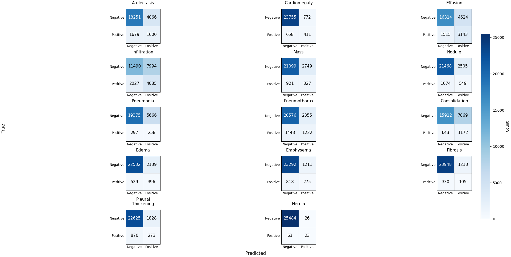
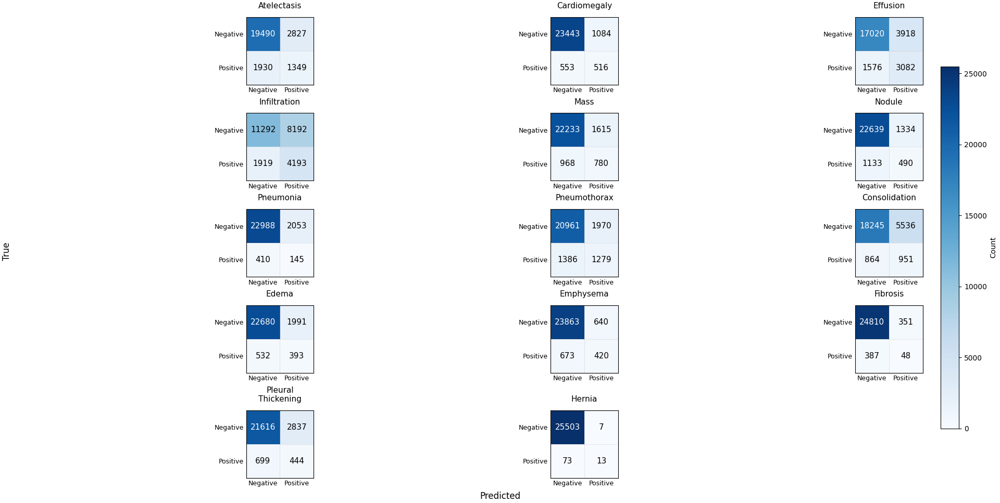
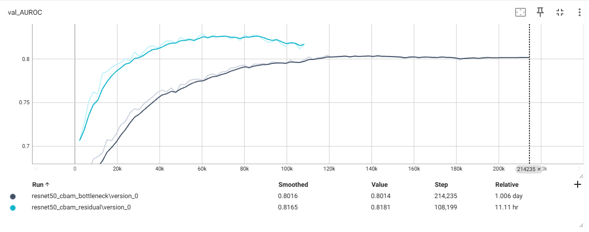
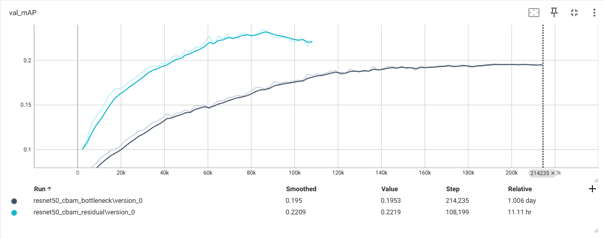

# Multi-labels diseases classification on [NIH Chest X-rays](https://www.kaggle.com/datasets/nih-chest-xrays/data/data)

## Model Performance

In this implementation, the overall model performance appears **relatively poor** on the NIH Chest X-ray multi-label classification task.  
Despite experimenting with different ResNet-based architectures — namely **ResNet Bottleneck** (widths = 32 → 64 → 128 → 256) and **ResNet Residual** (widths = 64 → 128 → 256 → 512) — both variants achieve **comparable precision, recall, and F1-score**.

### Per-Class Metrics Comparison

| Class                | Bottleneck P | Bottleneck R | Bottleneck F1 | Residual P | Residual R | Residual F1 | Support |
|----------------------|:------------:|:------------:|:-------------:|:----------:|:----------:|:-----------:|--------:|
| Atelectasis          | 0.28 | 0.49 | 0.36 | 0.32 | 0.41 | 0.36 | 3279 |
| Cardiomegaly         | 0.35 | 0.38 | 0.37 | 0.32 | 0.48 | 0.39 | 1069 |
| Effusion             | 0.40 | 0.67 | 0.51 | 0.44 | 0.66 | 0.53 | 4658 |
| Infiltration         | 0.34 | 0.67 | 0.45 | 0.34 | 0.69 | 0.45 | 6112 |
| Mass                 | 0.23 | 0.47 | 0.31 | 0.33 | 0.45 | 0.38 | 1748 |
| Nodule               | 0.18 | 0.34 | 0.23 | 0.27 | 0.30 | 0.28 | 1623 |
| Pneumonia            | 0.04 | 0.46 | 0.08 | 0.07 | 0.26 | 0.11 |  555 |
| Pneumothorax         | 0.34 | 0.46 | 0.39 | 0.39 | 0.48 | 0.43 | 2665 |
| Consolidation        | 0.13 | 0.65 | 0.22 | 0.15 | 0.52 | 0.23 | 1815 |
| Edema                | 0.16 | 0.43 | 0.23 | 0.16 | 0.42 | 0.24 |  925 |
| Emphysema            | 0.19 | 0.25 | 0.21 | 0.40 | 0.38 | 0.39 | 1093 |
| Fibrosis             | 0.08 | 0.24 | 0.12 | 0.12 | 0.11 | 0.12 |  435 |
| Pleural_Thickening   | 0.13 | 0.24 | 0.17 | 0.14 | 0.39 | 0.20 | 1143 |
| Hernia               | 0.47 | 0.27 | 0.34 | 0.65 | 0.15 | 0.25 |   86 |
| **micro avg**        | 0.24 | 0.53 | 0.33 | 0.29 | 0.52 | 0.37 | 27206 |
| **macro avg**        | 0.24 | 0.43 | 0.28 | 0.29 | 0.41 | 0.31 | 27206 |
| **weighted avg**     | 0.28 | 0.53 | 0.36 | 0.32 | 0.52 | 0.39 | 27206 |
| **samples avg**      | 0.19 | 0.33 | 0.22 | 0.23 | 0.33 | 0.25 | 27206 |

  
**Figure 1 — ResNet Bottleneck Model (widths = 32, 64, 128, 256)**

**Figure 2 — ResNet Residual Model (widths = 64, 128, 256, 512)**  

---

### Architectural Trade-offs

- **ResNet Bottleneck (widths = 32, 64, 128, 256)**  
  This variant adopts a bottleneck structure with reduced feature-map widths at each stage to minimize model size.
  In practice, however, this lightweight configuration required a **longer training duration** to reach the early stopping recall — approximately **24 hours** on an **RTX 4000 Ada** GPU — while achieving only comparable performance to the residual model.  
  This indicates **slower convergence** despite its smaller parameter count of approximately **6 million parameters** or **71.9 MB**.

  *note* the threshold used can be viewd at [thresholds.jon](./configs/thresholds.json)

- **ResNet Residual (widths = 64, 128, 256, 512)**  
  This version employs standard residual blocks with wider channels, providing higher representational capacity.

  It reached the same early stopping recall in approximately **11 hours** on the **RTX 4000 Ada**, demonstrating **faster convergence** and **similar overall performance**, though with a **larger model size** of approximately **24 million parameters** or **244 MB**.

  *note* the threshold used can be viewd at [thresholds2.jon](./configs/thresholds_2.json)

**Figure 1 — Comparision on validate AUROC**

**Figure 1 — Comparision on validate mAP**

### Implemented Components
- [ResNet](https://arxiv.org/abs/1512.03385)

- [Fine-tuning CNN Image Retrieval with No Human Annotation](https://arxiv.org/abs/1711.02512)

- [CBAM: Convolutional Block Attention Module](https://arxiv.org/abs/1807.06521)

### To do
* [ ] Improve F-1 and mAP score
* [ ] diseases' bounding box detection(?)